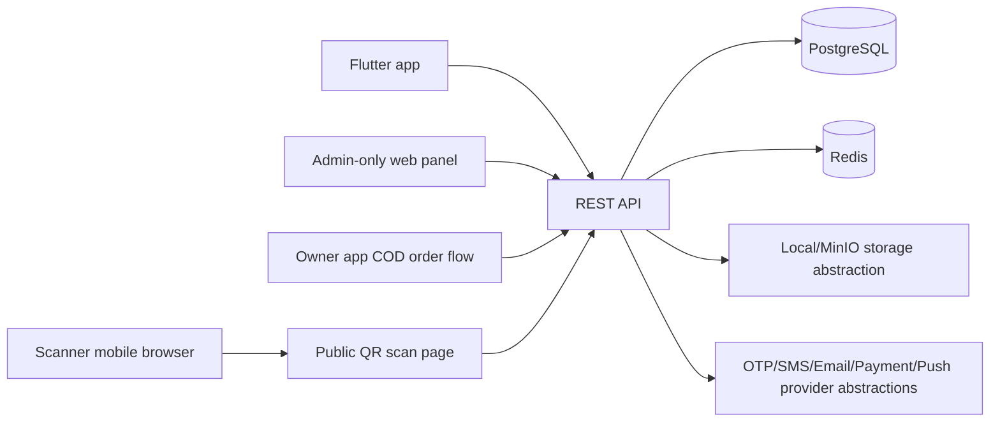
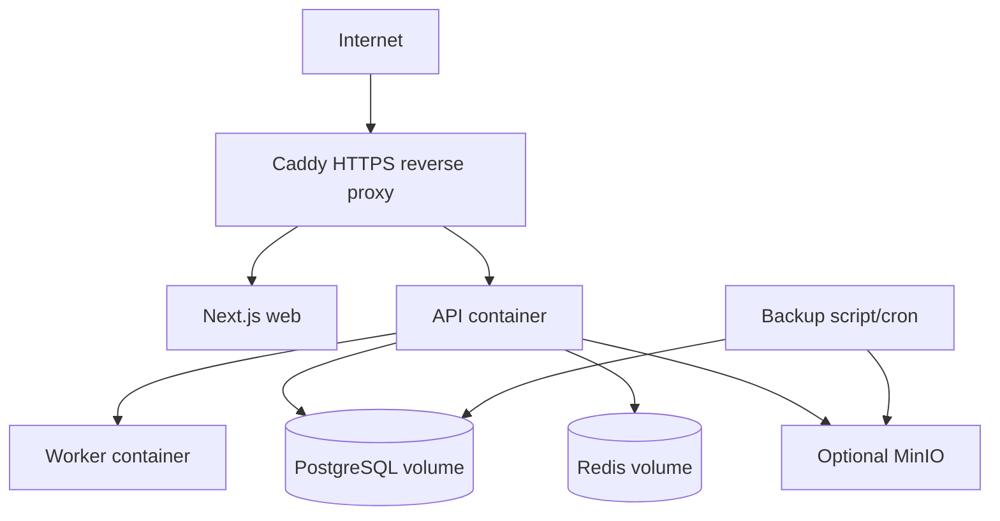

# ScanContact BD Architecture

ScanContact BD is a privacy-first QR private contact platform for Bangladesh. The MVP is built as a self-hostable monorepo with a Next.js web app, Express/TypeScript REST API, PostgreSQL via Prisma, Redis-ready worker process, and a Flutter Android/iOS-ready app.

## Product Architecture

## Core Security Decisions

- QR codes contain only `https://yourdomain.com/t/{publicSlug}`.
- Phone numbers, addresses, emergency contacts, and documents are private by default.
- OTPs are hashed with a server secret and expire quickly.
- Access tokens are short lived. Refresh tokens are rotated and stored hashed.
- Public contact requests are rate limited and saved without exposing scanner identity unless voluntarily provided.
- Admin actions are audit logged.
- COD works in the MVP; online payment providers are backend-verified placeholders.
- Call masking is intentionally not implemented until a legal telecom/VoIP provider is approved.

## Deployment Shape

## UI Design System

- Visual tone: trustworthy, clean, Bangladesh-first, fast on mobile data.
- Palette: deep teal for trust, fresh green for confirmation, warm amber for attention, neutral zinc/slate for readable surfaces.
- Components: large mobile-first buttons, compact admin tables, status chips, privacy notices, high-contrast public scan actions.
- Typography: system fonts for performance and Bangla support.
- Web is admin-only except for public QR scan and scanner conversation links.
- Public scan pages are deliberately minimal: tag context, safety note, contact form, optional explicit channels, and abuse reporting.
- Owners use the separate Flutter owner app for login/signup, assigned QR tags, COD orders, notifications, and private chat replies.

## Milestones

1. Core API, schema, OTP, tags, public scan, contact request, notifications.
2. Admin web panel plus public scan/chat pages.
3. Separate Flutter owner app with auth, QR list, requests, notifications, and COD QR ordering.
4. Docker, backups, seed data, tests, and operational docs.
5. Production integrations: SMS gateway, bKash/Nagad/SSLCommerz, push, external backups, app store release.
